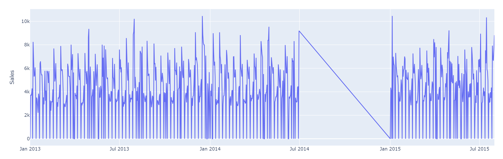
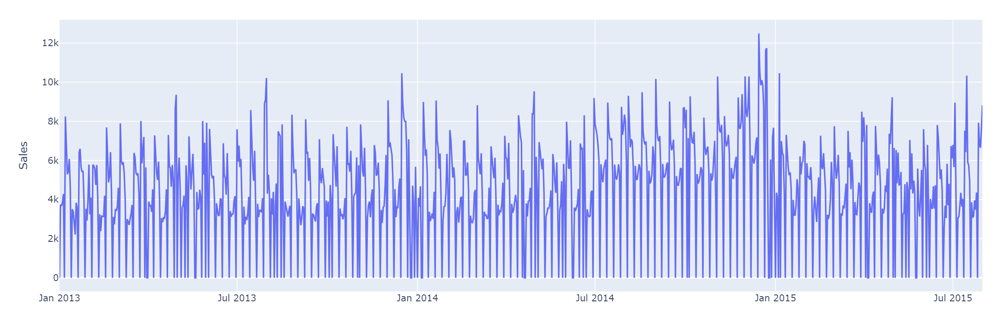
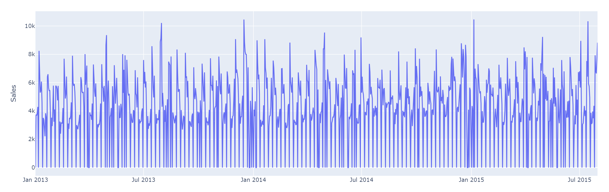
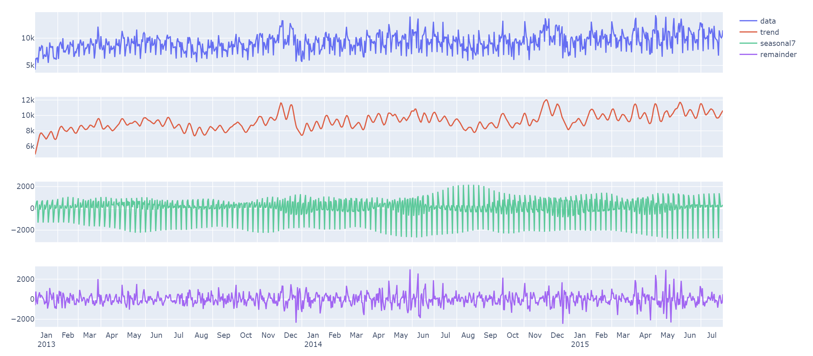
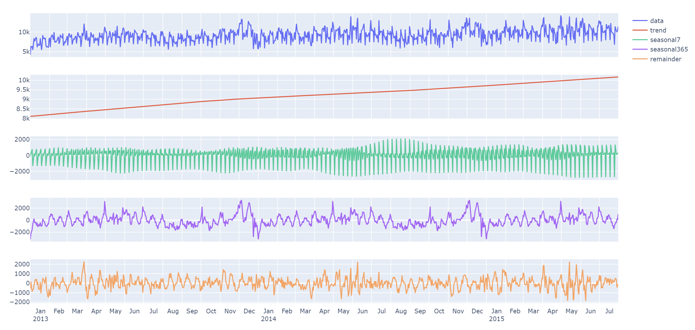
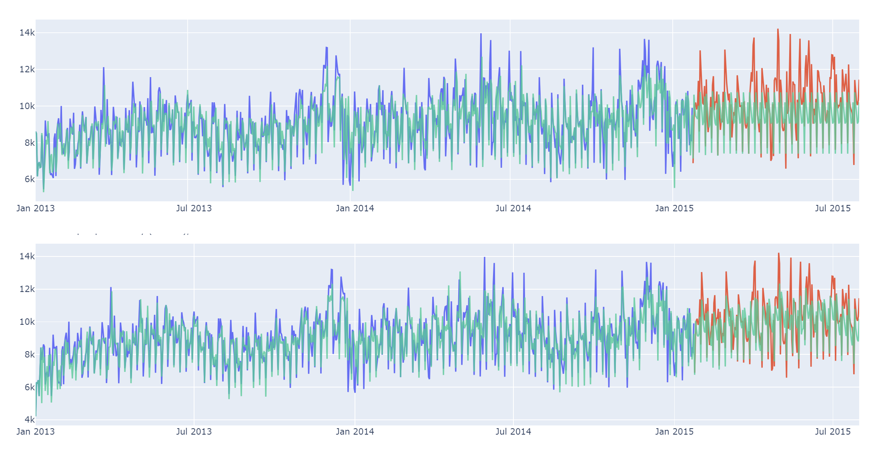

# Rossman Store SARIMAX

The [dataset](https://www.kaggle.com/c/rossmann-store-sales) contains 1115 unique Rossman stores, and they are categorized into 4 groups (A, B, C, D) based on their characteristic.

The original competition is meant to forecast the sales of each store, but since I use it to learn SARIMAX, I decided to aggregate the stores from the same category into a single time series.

Store type B is particularly interesting, because it opens on weekend and most holidays, making the characteristic totally different than the others. Here's the performance of each model on store type B:

|Model|RMSE|
|---|---|
|ETS|1548|
|SARIMA (weekly seasonality)|1393|
|SARIMAX (plus yearly seasonality)|1094|

The forecast visualization can be seen at the end of problem 2. Other interesting parts, such as EDA and the order selection from the ACF/PACF plot can be seen directly on the [notebook](notebook.ipynb).

## Project Stack

The projects use these three as the main dependencies (Python):

|Dependency|Usage|
|---|---|
|Polars|Dataframe|
|Plotly|Visualization|
|StatsForecast|Forecasting|

## Highlighted Problems

### Problem 1 - Missing Sales

One of the problems on the Rossman store dataset is the missing sales between July 2014 to January 2015 on many of its stores. Here's the example of one of the store:

Luckily, not all stores have missing sales during this period, so I filled the missing sales using the median sales from stores that don't have missing sales. The median sales is aggregated by the store category (A, B, C, D) and the date. See the result below.

However, it's still not good enough. Turns out the median stores have an overall higher sales compared to the current store we're looking at. The filled values will also become higher than the rest of the values.

To solve this, I had to keep track from which store the missing sales was filled from on each date, let's call this store X (may differ on each date). The sales ratio (calculated separately) between store X and current store is then used to normalize the filled value (similar to [inflation adjustment](https://otexts.com/fpp3/transformations.html#inflation-adjustments) technique).

### Problem 2 - Multiple Seasonalities

By looking at the previous graph, the Rossman stores clearly have a repeating pattern every 7 days (weekly seasonality). This is also confirmed by the STL decomposition below.

However, most people from the competition seem to fail noticing the secondary seasonality. If we look at the trend (red line), we can actually squeeze out another yearly seasonality from it, because there's a spike around December on each year.

If we use 2 seasonalities (weekly + yearly), the trend (red line) will also become linear, which makes long-term prediction easier.

Because SARIMA only support 1 seasonality, I added the extra seasonality as exogenous feature (SARIMAX), and transformed the values as sin-cos pairs using the [Fourier terms](https://en.wikipedia.org/wiki/Fourier_series) formula.

Below is the prediction result before (only 1 seasonality) and after using 2 seasonalities. The green line is the prediction, while the red line is the true value.

Despite having a pretty good result, SARIMAX still can occasionally mistake the trend direction (e.g. predicting upward trend when it should be downward). This can be fixed by using rolling forecast, i.e. continuously refitting the model as new data comes in.
